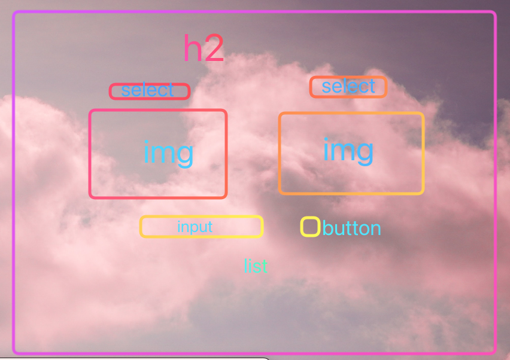

### html

-   h2
-   label for Wigs
-   selector for wigs (+ options)
-   img display
-   label for location
-   selector for location (+ options)
-   img display
-   section for phrases
-   h3
-   input for phrases (type = 'text')
-   button to add phrase
-   ul for list display

### Learning Objectives

-   Use a for/of loop to run a function against every item in an array
-   In response to a user event, add a new item to a state array and display the new state to the user
-   Use the .value property to get the value of a 'grabbed' HTML form input tag
-   Use .createElement() and .append() to display a new HTML tag (with .textContent ) to a grabbed DOM element on click.
-   Create a select element to create a dropdown.
-   Use template literals to concatenate strings
-   Identify what variables are in a given scope/closure

| Events . . .                                                                                                                                          |     |
| :---------------------------------------------------------------------------------------------------------------------------------------------------- | --: |
| Select from at least three dropdowns with at least three options each                                                                                 |   2 |
| On choosing an option from the dropdown and see the change reflected in the UI with a new image                                                       |   1 |
| On change, See all catchphrases rendered to the DOM                                                                                                   |   2 |
| When submitting a catchphrase, add it to an array of catchphrases, clear the current DOM's list of catchphrases, and list all catchphrases in the DOM |   1 |
| See displayed how many times each dropdown has been changed in the current session                                                                    |   1 |

| Functions                                                                                                                                   |     |
| :------------------------------------------------------------------------------------------------------------------------------------------ | --: |
| IMPURE: `displayStats() : mutates the DOM to display a string describing the counts.`                                                       |   1 |
| IMPURE: `displayCatchphrases() : clears out the old list from the DOM, loops through catchphrases, renders and appends to the list element` |   2 |
